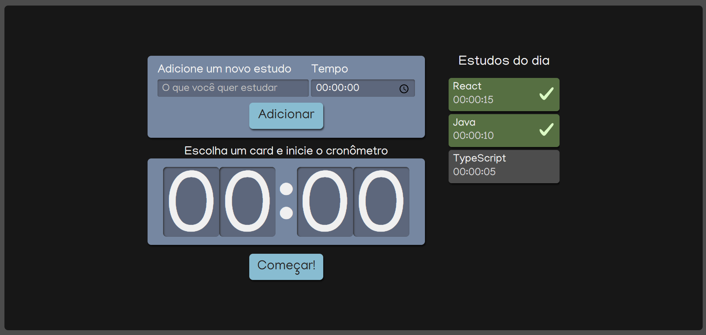

# ⏱️ Cronômetro de Estudos - Alura

> Projeto desenvolvido durante o curso de TypeScript da Alura  
> **Tecnologias:** React + TypeScript + Sass

---

## 🎯 Objetivo

O objetivo do projeto é adicionar uma atividade e cronometrar o tempo que quero estudar diáriamente.

### 🖥️ Funcionalidades
   - Temporizador regressivo
   - Formatação digital (00:00:00)
   - Controle de start/pause

--- 

### 🎴 Cards de Estudo
- Criação de Componentes
- Renderização dinâmica de arrays
- Conhecendo Props
- Estilização com SAss
- Refatoração de Lista
- useState
- Reaproveitamento de interfaces
- useEffect

## 🚀 Como Rodar o Projeto Localmente

Siga as instruções abaixo para rodar o projeto localmente:

1. Clone o repositório:
   ```bash
   git clone https://github.com/KaiqueBorgesdeOliveira/curso-ts

2. Acesse o diretório do projeto:
   ```cd
    https://github.com/KaiqueBorgesdeOliveira/curso-ts

Se você tem interesse em colaborar ou tem alguma oportunidade, entre em contato comigo:

- Email: borgeskaique438@gmail.com
- LinkedIn: [Meu Perfil no LinkedIn](https://www.linkedin.com/in/kaique-borges-3b5478117/)